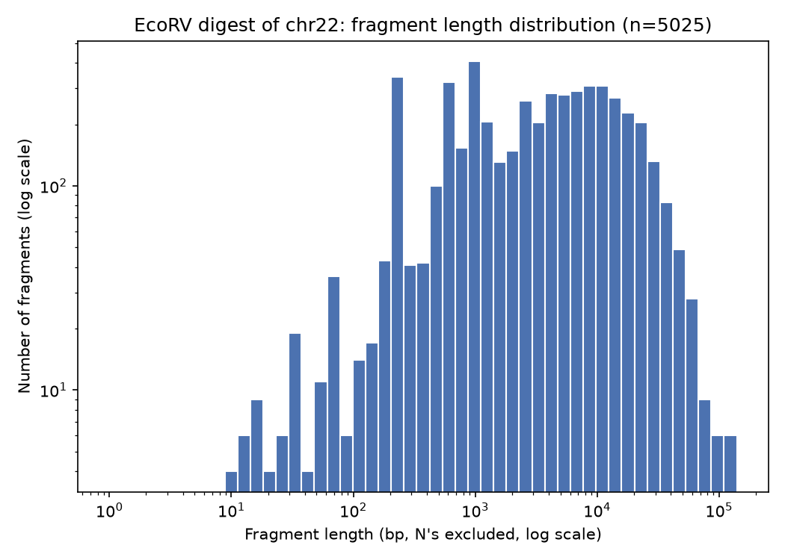

# COMP3353 Bioinformatics — Assignment 1: Sequence Analysis

Name: Zheng Choi I

University Number: 3035987788

Email: u3598778@connect.hku.hk

## Question 1: Counting DNA nucleotides

A DNA string is built from an alphabet of four symbols/nucleotides: 'A', 'C', 'G' and 'T'.
Input: path to a FASTA file. Output: four integers, the count of A, C, G, T (case-insensitive).

```python
from collections import Counter


def count_nucleotides(path):
    counts = Counter()
    with open(path) as f:
        for line in f:
            if line.startswith(">"):
                continue
            for ch in line.strip().upper():
                if ch in "ACGT":
                    counts[ch] += 1
    return counts["A"], counts["C"], counts["G"], counts["T"]


if __name__ == "__main__":
    print(count_nucleotides("data/Q1/input1.fa"))
    print(count_nucleotides("data/Q1/chr22.fa"))
```

Output on `data/Q1/input1.fa`: A=13 C=13 G=17 T=17
Output on `data/Q1/chr22.fa`: A=10382214 C=9160652 G=9246186 T=10370725

## Question 2: Finding a motif in DNA

Input: path to a FASTA file and a motif string s. Output: count of occurrences of s
as a substring of the sequence (forward strand only).

```python
def read_fasta(path):
    lines = []
    for line in open(path):
        if not line.startswith(">"):
            lines.append(line.strip())
    return "".join(lines)


def count_motif(seq, motif):
    seq = seq.upper()
    motif = motif.upper()
    count = 0
    i = seq.find(motif)
    while i != -1:
        count += 1
        i = seq.find(motif, i + 1)  # overlapping matches
    return count


print(count_motif(read_fasta("data/Q1/input1.fa"), "CGTAACC"))
print(count_motif(read_fasta("data/Q1/chr22.fa"), "CGTAACC"))
```

Output on `{path: "data/Q1/input1.fa", s: "CGTAACC"}`: 4
Output on `{path: "data/Q1/chr22.fa", s: "CGTAACC"}`: 206

## Question 3: Consensus and profile matrix

Input: a FASTA file of equal-length aligned DNA sequences. Output: the consensus
string, and the 3 positions (1-based) where the sequences vary the most.

Metric used: mismatches to the consensus base, i.e. for each column,
`N − (count of the most common base)`. A column where every sequence agrees
scores 0; a column split across several bases scores higher. Ties (columns
with the same mismatch count) are broken by sum-of-pairs mismatches — for
every pair of sequences in the column, count how many pairs disagree. This
matters when two columns have the same total mismatch count but a different
shape: e.g. one column split 17/8 between two bases and another split
17/6/2 across three bases both count as "8 mismatches", but the second one
has more disagreeing pairs (148 vs 136), so it's ranked as more variable.

```python
BASES = "ACGT"


def read_fasta(path):
    seqs = []
    seq = ""
    for line in open(path):
        line = line.strip()
        if line.startswith(">"):
            if seq:
                seqs.append(seq)
            seq = ""
        else:
            seq += line.upper()
    if seq:
        seqs.append(seq)
    return seqs


seqs = read_fasta("data/Q3/BRCA_aligned.fa")
n = len(seqs)
length = len(seqs[0])

# profile matrix: count of each base at each column
profile = {b: [0] * length for b in BASES}
for seq in seqs:
    for i, ch in enumerate(seq):
        if ch in BASES:
            profile[ch][i] += 1

# consensus + variability per column
# variability = mismatches to consensus (N - majority count), tiebroken by
# sum-of-pairs mismatches (how many of the 25*24/2 sequence pairs disagree
# at that column) -- this separates a clean two-way split (e.g. 17/8) from
# a messier three-way split (e.g. 17/6/2) that has the same mismatch count
consensus = ""
mismatches = []
pair_mismatches = []
for i in range(length):
    counts = [profile[b][i] for b in BASES]
    total = sum(counts)
    consensus += BASES[counts.index(max(counts))]
    mismatches.append(total - max(counts))

    nonzero = [c for c in counts if c > 0]
    sp = sum(nonzero[a] * nonzero[b] for a in range(len(nonzero)) for b in range(a + 1, len(nonzero)))
    pair_mismatches.append(sp)

top3 = sorted(range(length), key=lambda i: (-mismatches[i], -pair_mismatches[i]))[:3]
top3_positions = [i + 1 for i in top3]  # 1-based

print("Consensus string:")
print(consensus)
print("Top 3 least-conserved positions (1-based):", top3_positions)
print("Mismatches to consensus at those positions:", [mismatches[i] for i in top3])
print("Sum-of-pairs mismatches at those positions:", [pair_mismatches[i] for i in top3])
```

Output on `data/Q3/BRCA_aligned.fa`:
```
GATGGGTTGTGTTTGGTTTCTTTCAGCATGATTTTGAAGTCAGAGGAGATGTGGTCAATGGAAGAAACCACCAAGGTCCAAAGCGAGCAAGAGAATCCCAGGACAGAAAGGTAAAGCTCCCTCCCTCAAGTTGACAAAAATCTCACCCCACCACTCTGTATTCCACTCCCCTTTGCAGAGATGGGCCGCTTCATTTTGTAAGACTTATTACATACATACACAGTGCTAGATACTTTCACACAGGTTCTTTTTTCACTCTTCCATCCCAACCACATAAATAAGTATTGTCTCTACTTTATGAATGATAAAACTAAGAGATTTAGAGAGGCTGTGTA
```
Top 3 least-conserved positions (1-based): 26, 158, 4 (all 8 mismatches; sum-of-pairs 148, 148, 136)

## Question 4: Multiple sequence alignment and covariation matrices

Input: a FASTA file of equal-length aligned protein sequences (20 amino acids + gap "-").
Output: the consensus string and the top 10 co-varying column pairs by mutual information,
MI(i,j) = sum_a sum_b f_ij(a,b) * log2( f_ij(a,b) / (f_i(a) * f_j(b)) ).

```python
from collections import Counter
from math import log2

AMINO_ACIDS = set("ACDEFGHIKLMNPQRSTVWY")


def read_fasta(path):
    seqs = []
    seq = ""
    for line in open(path):
        line = line.strip()
        if line.startswith(">"):
            if seq:
                seqs.append(seq)
            seq = ""
        else:
            seq += line.upper()
    if seq:
        seqs.append(seq)
    return seqs


def clean(ch):
    return ch if ch in AMINO_ACIDS else "-"


seqs = read_fasta("data/Q4/DHFR_aligned.fa")
n = len(seqs)
length = len(seqs[0])

columns = [[clean(seq[i]) for seq in seqs] for i in range(length)]
freqs = [Counter(col) for col in columns]
for f in freqs:
    for k in f:
        f[k] /= n

consensus = "".join(c.most_common(1)[0][0] for c in freqs)

results = []
for i in range(length):
    for j in range(i + 1, length):
        joint = Counter(zip(columns[i], columns[j]))
        mi = 0.0
        for (a, b), count in joint.items():
            pij = count / n
            mi += pij * log2(pij / (freqs[i][a] * freqs[j][b]))
        results.append((mi, i + 1, j + 1))

results.sort(reverse=True)

print("Consensus string:")
print(consensus)
print("Top 10 co-varying column pairs by mutual information:")
for mi, i, j in results[:10]:
    print(f"  columns ({i}, {j}): MI = {mi:.4f} bits")
```

Output on `data/Q4/DHFR_aligned.fa`:
```
MISLIVAMAENGVIGKDNDLPWHLPEDLKYFKRLTLGKPVIMGRKTWESIGRPLPGRRNIVLSRDPDYQAEGVEVVHSLEEALALAG-VEEVFVIGGAEIYAQALP-ADRLYLTEIDAEFEGDTFFPEIDPDEWEEVSREEHPADEKNGYDYTFVTYERK
```

Top 10 pairs (columns, MI in bits):
(149,150) 1.2409, (150,151) 1.1677, (68,70) 1.1111, (148,150) 1.0829,
(145,146) 1.0511, (13,122) 1.0165, (149,151) 1.0131, (6,8) 1.0072,
(151,152) 0.9992, (58,74) 0.9862

## Question 5: A restriction-nuclease case study

EcoRV recognizes GATATC and cuts blunt in the middle: GAT/ATC. Target sequence: chr22
(`data/Q1/chr22.fa`).

```python
import re
import statistics
import numpy as np
import matplotlib
matplotlib.use("Agg")
import matplotlib.pyplot as plt

SITE = "GATATC"
COMPLEMENT = str.maketrans("ACGT", "TGCA")

lines = []
for line in open("data/Q1/chr22.fa"):
    if not line.startswith(">"):
        lines.append(line.strip().upper())
seq = "".join(lines)

# (a) exact sites
count_exact = 0
i = seq.find(SITE)
while i != -1:
    count_exact += 1
    i = seq.find(SITE, i + 1)
print("(a) exact GATATC sites:", count_exact)

# (b) reverse complement
rc = SITE.translate(COMPLEMENT)[::-1]
print("(b) reverse complement of GATATC:", rc, "-> palindrome:", rc == SITE)

# (c) relaxed sites, mismatch allowed at position 3: GA[N]ATC
count_relaxed = len(re.findall(r"(?=(GA[ACGT]ATC))", seq))
print("(c) total GA[N]ATC sites:", count_relaxed,
      "(exact:", count_exact, ", relaxed-only:", count_relaxed - count_exact, ")")

# (d) cut at every exact site (after the 3rd base: GAT/ATC), N's excluded from lengths
cuts = []
i = seq.find(SITE)
while i != -1:
    cuts.append(i + 3)
    i = seq.find(SITE, i + len(SITE))

boundaries = [0] + cuts + [len(seq)]
fragment_lengths = []
for start, end in zip(boundaries, boundaries[1:]):
    fragment = seq[start:end]
    fragment_lengths.append(len(fragment) - fragment.count("N"))

print("(d) number of fragments:", len(fragment_lengths))
print("(d) median fragment length:", statistics.median(fragment_lengths))

positive = [l for l in fragment_lengths if l > 0]
bins = np.logspace(0, np.log10(max(positive)), 50)
plt.hist(positive, bins=bins)
plt.xscale("log")
plt.yscale("log")
plt.xlabel("Fragment length (bp, N excluded)")
plt.ylabel("Number of fragments")
plt.title("EcoRV digest of chr22: fragment length distribution")
plt.savefig("results/q5d_fragment_length_hist.png", dpi=150)
```

a. How many perfectly matching EcoRV sites are present in chr22?
   **5024**

b. EcoRV's site is a palindrome. Its reverse complement is **GATATC** (same as itself).
   We only need the forward strand because a palindromic site reads the same on both
   strands at the same position — the reverse strand never reveals a new site, only
   the same ones already found on the forward strand.

c. Mutant EcoRV cuts GAX/ATC (mismatch tolerated at position 3). Check string
   `TTGATATCAAGAGATCCTTCCGAAATCACGT` gives 1 exact + 2 relaxed sites, matching the
   assignment's example. On chr22: **31370** total sites (5024 exact + 26346 relaxed-only).

d. Cutting chr22 at every exact site: **5025** fragments, median length **3561 bp**
   (N's excluded). Distribution:



## Question 6: ORF finder

ORF: start codon ATG to the first in-frame stop codon (TAA/TAG/TGA). Target: E. coli
genome (`data/Q6/ecoli_genome.fa`).

```python
import csv

CODON_TABLE = {
    "TTT": "F", "TTC": "F", "TTA": "L", "TTG": "L",
    "CTT": "L", "CTC": "L", "CTA": "L", "CTG": "L",
    "ATT": "I", "ATC": "I", "ATA": "I", "ATG": "M",
    "GTT": "V", "GTC": "V", "GTA": "V", "GTG": "V",
    "TCT": "S", "TCC": "S", "TCA": "S", "TCG": "S",
    "CCT": "P", "CCC": "P", "CCA": "P", "CCG": "P",
    "ACT": "T", "ACC": "T", "ACA": "T", "ACG": "T",
    "GCT": "A", "GCC": "A", "GCA": "A", "GCG": "A",
    "TAT": "Y", "TAC": "Y", "TAA": "*", "TAG": "*",
    "CAT": "H", "CAC": "H", "CAA": "Q", "CAG": "Q",
    "AAT": "N", "AAC": "N", "AAA": "K", "AAG": "K",
    "GAT": "D", "GAC": "D", "GAA": "E", "GAG": "E",
    "TGT": "C", "TGC": "C", "TGA": "*", "TGG": "W",
    "CGT": "R", "CGC": "R", "CGA": "R", "CGG": "R",
    "AGT": "S", "AGC": "S", "AGA": "R", "AGG": "R",
    "GGT": "G", "GGC": "G", "GGA": "G", "GGG": "G",
}
STOP_CODONS = {"TAA", "TAG", "TGA"}
COMPLEMENT = str.maketrans("ACGT", "TGCA")


def revcomp(seq):
    return seq.translate(COMPLEMENT)[::-1]


def find_orfs(seq):
    # ATG -> next in-frame stop codon, per frame. Every ATG before a stop
    # gets its own ORF ending at that stop. ATGs with no stop are dropped.
    orfs = []
    for frame in range(3):
        open_starts = []
        for pos in range(frame, len(seq) - 2, 3):
            codon = seq[pos:pos + 3]
            if codon == "ATG":
                open_starts.append(pos)
            elif codon in STOP_CODONS:
                for start in open_starts:
                    protein = "".join(CODON_TABLE.get(seq[c:c + 3], "X") for c in range(start, pos, 3))
                    orfs.append((start, pos + 3, protein))
                open_starts = []
    return orfs


lines = []
for line in open("data/Q6/ecoli_genome.fa"):
    if not line.startswith(">"):
        lines.append(line.strip().upper())
genome = "".join(lines)
genome_len = len(genome)

# positions are reported in 1-based genome coordinates on the forward strand;
# for "-" strand ORFs, start/end are still those forward coordinates, just
# read from high to low (start = 5' end of the ORF on the minus strand)
orfs = []
for start, end, protein in find_orfs(genome):
    orfs.append(("+", start + 1, end, protein))

rc = revcomp(genome)
for start, end, protein in find_orfs(rc):
    orfs.append(("-", genome_len - start, genome_len - end + 1, protein))

long_orfs = [o for o in orfs if len(o[3]) > 100]
long_orfs.sort(key=lambda o: (o[0], o[1]))

with open("results/q6_orfs.csv", "w", newline="") as f:
    writer = csv.writer(f)
    writer.writerow(["strand", "id", "start", "end", "protein"])
    for i, (strand, start, end, protein) in enumerate(long_orfs, 1):
        writer.writerow([strand, i, start, end, protein])

print("total ORFs (both strands):", len(orfs))
print("ORFs with protein > 100 aa:", len(long_orfs))

strand, start, end, protein = max(orfs, key=lambda o: len(o[3]))
print("longest ORF:", strand, start, end, "-", len(protein), "aa")
print(protein)
```

Check: `ATGGCCATGGCGCCCAGAACTGGGCCCTGA` translates to `MAMAPRTGP` — matches.

a. Forward-strand ORFs longer than 100 aa are written to `results/q6_orfs.csv`
   (columns: strand, id, start, end, protein), submitted alongside this document.

b. Reverse-strand ORFs use the same scan on the reverse complement, with coordinates
   mapped back onto the original genome numbering, and are appended to the same CSV
   (labeled "-"). Combined total: 153321 ORFs found on both strands; 30894 of them
   translate to a protein longer than 100 aa (these are the ones in the CSV).

c. Longest ORF: forward strand, genome position 2044911-2052014, 2367 amino acids
   (7104 nt including the stop codon):
```
MLARSGKVSMATKKRSGEEINDRQILCGMGIKLRRLTAGICLITQLAFPMAAAAQGVVNAATQQPVPAQIAIANANTVPYTLGALESAQSVAERFGISVAELRKLNQFRTFARGFDNVRQGDELDVPAQVSEKKLTPPPGNSSDNLEQQIASTSQQIGSLLAEDMNSEQAANMARGWASSQASGAMTDWLSRFGTARITLGVDEDFSLKNSQFDFLHPWYETPDNLFFSQHTLHRTDERTQINNGLGWRHFTPTWMSGINFFFDHDLSRYHSRAGIGAEYWRDYLKLSSNGYLRLTNWRSAPELDNDYEARPANGWDVRAESWLPAWPHLGGKLVYEQYYGDEVALFDKDDRQSNPHAITAGLNYTPFPLMTFSAEQRQGKQGENDTRFAVDFTWQPGSAMQKQLDPNEVAARRSLAGSRYDLVDRNNNIVLEYRKKELVRLTLTDPVTGKSGEVKSLVSSLQTKYALKGYNVEATALEAAGGKVVTTGKDILVTLPAYRFTSTPETDNTWPIEVTAEDVKGNLSNREQSMVVVQAPTLSQKDSSVSLSTQTLNADSHSTATLTFIAHDAAGNPVVGLVLSTRHEGVQDITLSDWKDNGDGSYTQILTTGAMSGTLTLMPQLNGVDAAKAPAVVNIISVSSSRTHSSIKIDKDRYLSGNPIEVTVELRDENDKPVKEQKQQLNNAVSIDNVKPGVTTDWKETADGVYKATYTAYTKGSGLTAKLLMQNWNEDLHTAGFIIDANPQSAKIATLSASNNGVLANENAANTVSVNVADEGSNPINDHTVTFAVLSGSATSFNNQNTAKTDVNGLATFDLKSSKQEDNTVEVTLENGVKQTLIVSFVGDSSTAQVDLQKSKNEVVADGNDSVTMTATVRDAKGNLLNDVMVTFNVNSAEAKLSQTEVNSHDGIATATLTSLKNGDYRVTASVSSGSQANQQVNFIGDQSTAALTLSVPSGDITVTNTAPQYMTATLQDKNGNPLKDKEITFSVPNDVASKFSISNGGKGMTDSNGVAIASLTGTLAGTHMIMARLANSNVSDAQPMTFVADKDRAVVVLQTSKAEIIGNGVDETTLTATVKDPSNHPVAGITVNFTMPQDVAANFTLENNGIAITQANGEAHVTLKGKKAGTHTVTATLGNNNTSDSQPVTFVADKASAQVVLQISKDEITGNGVDSATLTATVKDQFDNEVNNLPVTFSSASSGLTLTPGVSNTNESGIAQATLAGVAFGEKTVTASLANNGASDNKTVHFIGDTAAAKIIELAPVPDSIIAGTPQNSSGSVITATVVDNNGFPVKGVTVNFTSNAATAEMTNGGQAVTNEQGKATVTYTNTRSSIESGARPDTVEASLENGSSTLSTSINVNADASTAHLTLLQALFDTVSAGETTSLYIEVKDNYGNGVPQQEVTLSVSPSEGVTPSNNAIYTTNHDGNFYASFTATKAGVYQLTATLENGDSMQQTVTYVPNVANAEITLAASKDPVIADNNDLTTLTATVADTEGNAIANTEVTFTLPEDVKANFTLSDGGKVITDAEGKAKVTLKGTKAGAHTVTASMTGGKSEQLVVNFIADTLTAQVNLNVTEDNFIANNVGMTRLQATVTDGNGNPLANEAVTFTLPADVSASFTLGQGGSAITDINGKAEVTLSGTKSGTYPVTVSVNNYGVSDTKQVTLIADAGTAKLASLTSVYSFVVSTTEGATMTASVTDANGNPVEGIKVNFRGTSVTLSSTSVETDDRGFAEILVTSTEVGLKTVSASLADKPTEVISRLLNASADVNSATITSLEIPEGQVMVAQDVAVKAHVNDQFGNPVAHQPVTFSAEPSSQMIISQNTVSTNTQGVAEVTMTPERNGSYMVKASLPNGASLEKQLEAIDEKLTLTASSPLIGVYAPTGATLTATLTSANGTPVEGQVINFSVTPEGATLSGGKVRTNSSGQAPVVLTSNKVGTYTVTASFHNGVTIQTQTTVKVTGNSSTAHVASFIADPSTIAATNTDLSTLKATVEDGSGNLIEGLTVYFALKSGSATLTSLTAVTDQNGIATTSVKGAMTGSVTVSAVTTAGGMQTVDITLVAGPADTSQSVLKSNRSSLKGDYTDSAELRLVLHDISGNPIKVSEGMEFVQSGTNVPYIKISAIDYSLNINGDYKATVTGGGEGIATLIPVLNGVHQAGLSTTIQFTRAEDKIMSGTVSVNGTDLPTTTFPSQGFTGAYYQLNNDNFAPGKTAADYEFSSSASWVDVDATGKVTFKNVGSNSERITATPKSGGPSYVYEIRVKSWWVNAGEAFMIYSLAENFCSSNGYTLPRANYLNHCSSRGIGSLYSEWGDMGHYTTDAGFQSNMYWSSSPANSSEQYVVSLATGDQSVFEKLGFAYATCYKNL
```

This is `yeeJ`, an inverse autotransporter adhesin — MG1655 YeeJ is reported at 2358 aa
(minor version difference from our 2367 aa, same gene), and the repeated ~90-residue
blocks in the sequence match its ~13 bacterial Ig-like (Big) domains. It binds
peptidoglycan and promotes biofilm formation (Meuskens et al., Sci Rep 2017,
https://www.nature.com/articles/s41598-017-10902-0).
